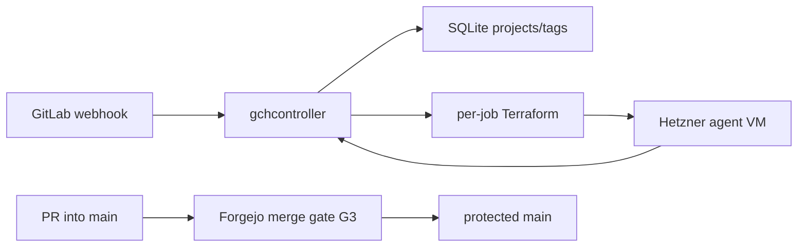
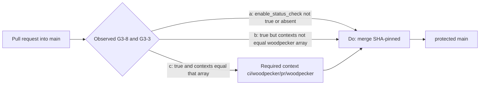

# Architecture overview

`code/gitlab-cursor-webhook` is **GCH** (GitLab Cloud Host): filter GitLab
webhooks and provision ephemeral Hetzner agent VMs that run the Cursor CLI.
Live product map (binaries, routes, filter rules, golden images, Terraform):
[`README.md`](../README.md). Docker/Coolify cutover:
[`docker-deploy.md`](docker-deploy.md). This file is the **merge gate** plus a
short runtime index. Do not copy README narrative here. Do not treat this file
as a second product architecture.

This tree is **not** the archival `PlasticDigits/gitlab-cursor-webhook`
(CAC invariant 21). Do not write that clone from here.

Catch-all `CODEOWNERS` removal is decided in
[ADR 0001](adr/0001-remove-catchall-codeowners.md)
([#3](https://git.cl8y.com/code/gitlab-cursor-webhook/issues/3)); do not
duplicate that narrative. Vehicle **B** copies this file and ADR 0001 onto the
product PR so `main` holds the standing contract. Design branch
`cac-design-issue-3` is transport only. After independent ACCEPT, pin that
accepted hex on leftover `{iid}` and on
[`pulls/3`](https://git.cl8y.com/code/gitlab-cursor-webhook/pulls/3); the
product tip must satisfy
`git diff <accepted> -- docs/adr/0001-remove-catchall-codeowners.md docs/architecture.md`
empty. Do not treat `62ffd58` as copyable.

## Runtime

| Layer | Choice |
|-------|--------|
| App | Rust workspace: `gchcontroller` (HTTP), `gchconfig` (SQLite CLI), `gch-core` (filter/dedup/db). |
| Ingress | `POST /webhook` (Standard Webhooks HMAC). Job API for agent VMs. Admin API behind `GCH_ADMIN_TOKEN`. |
| Data | SQLite (`GCH_DB_PATH`) + per-job Terraform state under `GCH_JOBS_DIR`. |
| Host | Coolify/Docker (`Dockerfile`, [`docker-compose.yml`](../docker-compose.yml)); persist `/var/lib/gch`. Git-follow / auto-rebuild on `main`, `pull_request`, or any non-`main` ref is **not** recorded in-tree. |
| Agents | Isolated Terraform apply of [`terraform/modules/agent-vm/`](../terraform/modules/agent-vm/) from a golden snapshot. |
| Legacy CI file | [`.gitlab-ci.yml`](../.gitlab-ci.yml) is GitLab Secret Detection leftover. It does **not** post Forgejo Woodpecker context `ci/woodpecker/pr/woodpecker`. |



No Coolify rebuild edge: that follow is unverified in-tree (**G3-6**). HMAC
tokens, `HCLOUD_TOKEN`, `CURSOR_API_KEY`, job runtime tokens, and Coolify
UUID/auto-deploy are **not** this ticket
([agent-control #297](https://git.cl8y.com/PlasticDigits/cl8y-agent-control/issues/297)).

## Forgejo merge gate {#forgejo-merge-gate}

Official CODEOWNERS review is **not** a merge gate. Decision, slices, tests,
rollback: [ADR 0001](adr/0001-remove-catchall-codeowners.md). Host write-up:
[cl8y-forgejo#48](https://git.cl8y.com/PlasticDigits/cl8y-forgejo/issues/48)
and forgejo PR **#50** (`docs/INVARIANTS.md` + ADR 0003 item 8). Unauthenticated
`#48` / forgejo `docs/INVARIANTS.md` are **404** from this pass; that
attribution is unverified. A 404 does not mean the policy is missing. Do not
fork INVARIANTS here. Deploy / spend / custody / policy expansion:
[agent-control #297](https://git.cl8y.com/PlasticDigits/cl8y-agent-control/issues/297)
— this ticket is none of those. Sister CAC autoland predicates are
[#429](https://git.cl8y.com/PlasticDigits/cl8y-agent-control/issues/429), not
this controller. [hello#15](https://git.cl8y.com/code/hello/pulls/15) is the
fleet canary, not a local iid.

### Issue #3 body vs host flags

[`issues/3`](https://git.cl8y.com/code/gitlab-cursor-webhook/issues/3) is the
same number as [`pulls/3`](https://git.cl8y.com/code/gitlab-cursor-webhook/pulls/3)
(`pull_request` present). That body is only:

> Remove catch-all CODEOWNERS … Merge gate remains: no direct `main`,
> Woodpecker `ci/woodpecker/pr/woodpecker`, no `force_merge`. See
> cl8y-forgejo#48 and docs/INVARIANTS.md.

Map those three bullets — not a six-row table, not **G3-*** IDs:

| Issue bullet | IDs |
| --- | --- |
| no direct `main` | **G3-2** |
| Woodpecker `ci/woodpecker/pr/woodpecker` | **G3-8** ∧ **G3-3** (procedure below) |
| no `force_merge` | **G3-4** |

**G3-9**, **G3-10**, and **G3-5** are #48 / host flags. Issue `#3` did not
publish them. Keywords in that body are not architecture approval.

### Merge gate (G3)

Three contract groups. The six-row table below is the
[cl8y-forgejo#48](https://git.cl8y.com/PlasticDigits/cl8y-forgejo/issues/48) /
forgejo `docs/INVARIANTS.md` **host target** for this repo’s `main` rule (that
source is unverified here: unauthenticated 404). It is **not** text issue `#3`
published. It is **not** a measured GET of this repo. Unauthenticated
`GET /api/v1/repos/code/gitlab-cursor-webhook/branch_protections` is **401**.
This tree has **no** dated protection JSON. Do not paste one from an
unauthenticated session. Requiring that GET in S0 would freeze design behind a
token this pass does not have. Fleet values / `code/hello` are not proof.

The list endpoint returns an **array**; pick `rule_name == "main"` (or
`GET /api/v1/repos/code/gitlab-cursor-webhook/branch_protections/main`). A
green `cargo test`, a Coolify rebuild, empty commit statuses, or a GET on a
different `code/*` repo is **not** proof of any flag.

**Observed vs target.** Leftover-complete **records** dated observed JSON and a
written vs-target diff. Drift is a **#48 leftover**, not a GCH PATCH, not a
reason to restore `CODEOWNERS`, and **not** an S3 fail. Land still fail-closes
on **G3-9** / **G3-10** (ADR Tests item 7) while leftover official requests
remain (they do on
[#3](https://git.cl8y.com/code/gitlab-cursor-webhook/pulls/3) and
[#2](https://git.cl8y.com/code/gitlab-cursor-webhook/pulls/2)). S2 implement
does not perform the GET. Repo admin **comments** the GET body; see ADR 0001
actors.

#### Protection GET target (six flags)

[cl8y-forgejo#48](https://git.cl8y.com/PlasticDigits/cl8y-forgejo/issues/48) /
forgejo `INVARIANTS.md` **host target**. Not a measured GET of
`code/gitlab-cursor-webhook`. Not the issue-`#3` body.

| ID | Flag | Target |
| --- | --- | --- |
| **G3-2** | `enable_push` | `false` (no direct push to `main`) |
| **G3-8** | `enable_status_check` | `true` |
| **G3-3** | `status_check_contexts` | `["ci/woodpecker/pr/woodpecker"]` (array **equal**, not subset) |
| **G3-9** | `required_approvals` | `0` |
| **G3-10** | `block_on_official_review_requests` | `false` |
| **G3-5** | `block_on_rejected_reviews` | `true` |

Merge procedure is not a protection field.

**G3-2** target is `enable_push == false` only. It does **not** mean “no
force-push.” Force-push allowlist fields (if the host exposes them) and
`apply_to_admins` stay
[cl8y-forgejo#48](https://git.cl8y.com/PlasticDigits/cl8y-forgejo/issues/48),
not this ticket. Leftover-complete does **not** require this match for S3
pass.

A leftover official CODEOWNERS request on an open PR (including #3 and #2) is
non-blocking **only after** repo admin **comments** dated GET JSON of **this**
repo’s `main` rule showing **G3-9** and **G3-10** on leftover `{iid}`
(`iid != 3`) **and** on `pulls/3`. Never call `#3` the leftover. If
`block_on_official_review_requests` is still `true` here, or
`required_approvals != 0`, or that JSON is missing, merge is 405 or still
review-gated; stop; that mismatch is a **named** local/host DEPS (ADR Decision
7 / Tests item 7). Do not `force_merge`. Do not infer those two flags from
fleet #48. S2 does not GET.

##### One Woodpecker land rule (observed G3-8 ∧ G3-3)

Canonical procedure for Decision 7, Tests item 9, land criterion 7, the
mermaid, and the `issues/3` ≡ `pulls/3` body. Host CI is not an in-diff
deliverable. This tree had **no** `.woodpecker.yaml` / `.woodpecker/` on
`main` when #3 was filed; incomplete product tip
`022f4f510113c6e8fcfd973a0869753a6fb375be` (`draft: false`) had **empty**
commit statuses (`[]`). `.gitlab-ci.yml` does not post
`ci/woodpecker/pr/woodpecker`. Do not add `.woodpecker.yaml` / `.woodpecker/`
in the #3 diff. Do not fake statuses. Do not `force_merge`.

Repo admin dated GET JSON of **this** repo’s `main` rule (same GET as
**G3-9** / **G3-10**; S2 does not perform it). Key on **G3-8 ∧ G3-3**. Do
**not** dispatch on “**G3-8** is `false` or status checks unset.”

- **(a)** `enable_status_check != true` or the field is absent → do **not**
  wait on Woodpecker for land of `#3`.
- **(b)** `enable_status_check == true` and `status_check_contexts` is **not**
  equal to `["ci/woodpecker/pr/woodpecker"]` → do **not** wait on that name;
  record **G3-3** drift as a **named** #48 / host DEPS. Do not wait forever
  for a context the host does not require.
- **(c)** `enable_status_check == true` **and** `status_check_contexts`
  equals `["ci/woodpecker/pr/woodpecker"]` → the host will block merge until
  that context is green on the product-tip SHA. Then use one **unstick** path
  (pick one; record its iid / identity as DEPS). A leftover “enable/post”
  issue is **not** sufficient DEPS:
  1. Predecessor PR (`iid != 3`) that **may** add `.woodpecker.yaml` /
     `.woodpecker/`, merged first, after which that pipeline posts onto
     `#3`’s SHA; or
  2. Org / server Woodpecker pipeline (not in the `#3` diff) already posting
     onto `#3`’s SHA; or
  3. Named host ticket (cl8y-forgejo iid or a local issue that is **not**
     leftover `{iid}`) that may clear **G3-8** / **G3-3** long enough to
     install the first pipeline.

File-delete + docs on the tip does not satisfy **(c)**. There is no “when one
exists” hedge.

#### Merge procedure

| ID | Rule |
| --- | --- |
| **G3-4** | SHA-pinned `Do: merge` with `head_commit_id`. Never document or use `force_merge`. Actor: `@PlasticDigits` after ADR Integration items 5–7. CAC [#429](https://git.cl8y.com/PlasticDigits/cl8y-agent-control/issues/429) does not merge this PR. |

#### Tree contracts

| ID | Rule |
| --- | --- |
| **G3-1** | `test -f` fails on `CODEOWNERS`, `docs/CODEOWNERS`, `.gitea/CODEOWNERS`, and `.forgejo/CODEOWNERS`. |
| **G3-6** | This Coolify app **may** rebuild if the existing host is git-follow on `main` (not verified in-tree). [`docker-compose.yml`](../docker-compose.yml) and [`docker-deploy.md`](docker-deploy.md) only record Dockerfile deploy plus `/var/lib/gch`. They do **not** record git-follow, auto-deploy, rebuild-on-`main`, or Coolify builds on `pull_request` / non-`main`. This ticket does not add PR deploys, rotate tokens/UUIDs, or edit `Dockerfile` / `docker-compose.yml` / entrypoint. A rebuild is not leftover-complete and is not a #297 grant. Plant-check `{n}` recovery if it merges: ADR Tests item 4. Coolify secrets never attach to `pull_request` events. |
| **G3-7** | This tree does not expand CAC merge/deploy/spend/custody policy. |

Forgejo loads the first existing file among `CODEOWNERS`, `docs/CODEOWNERS`,
`.gitea/CODEOWNERS`, and `.forgejo/CODEOWNERS` (Go-regexp, not GitHub globs;
`.forgejo/` added in forgejo#8773; `.gitea/` remains in the walk). After
ADR 0001, **G3-1** holds. None of those four paths may contain a reviewer rule
for any pattern (ADR 0001 Decision 2). Do not leave an empty or comments-only
file; Forgejo still parses it.



Standing merge procedure **after** vehicle **B** land — not the `#3`
checklist. Land of `#3` still needs ADR 0001 Integration items **5–7**
(leftover `{iid}` with two `@login`s, admin **G3-9** / **G3-10** comment,
Decision 7). Case **(c)** unstick for `#3` (this diff must not add
`.woodpecker.yaml`) is the three-path list above, not this diagram.
`cargo test` / `cargo clippy` are contributor checks, not **G3-3**.

This tree does not change Forgejo protection JSON, CAC autoland predicates, or
Coolify app config. Those remain
[cl8y-forgejo#48](https://git.cl8y.com/PlasticDigits/cl8y-forgejo/issues/48),
[cl8y-agent-control#429](https://git.cl8y.com/PlasticDigits/cl8y-agent-control/issues/429),
and [agent-control #297](https://git.cl8y.com/PlasticDigits/cl8y-agent-control/issues/297)
respectively.

## Directory (agents)

```
crates/gchcontroller/  HTTP webhook + job API + Terraform provision
crates/gchconfig/      SQLite CLI
crates/gch-core/       filter, dedup, db, prompt render
terraform/             firewall + agent-vm module
docs/adr/              versioned decisions
docs/architecture.md   this file (merge gate G3; not product architecture)
README.md              product map
docs/docker-deploy.md  Coolify cutover
docs/admin-golden-image.md
.gitlab-ci.yml         GitLab leftover; not the Forgejo merge context
```

## ADRs

| ADR | Topic |
|-----|--------|
| [0001](adr/0001-remove-catchall-codeowners.md) | Remove catch-all CODEOWNERS ([#3](https://git.cl8y.com/code/gitlab-cursor-webhook/issues/3)) |
