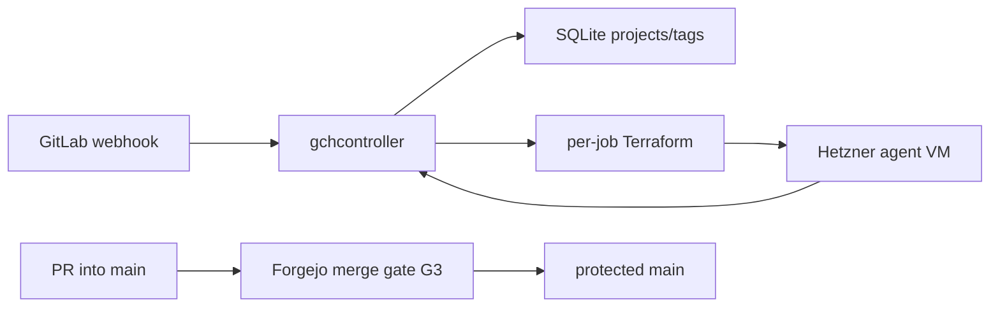
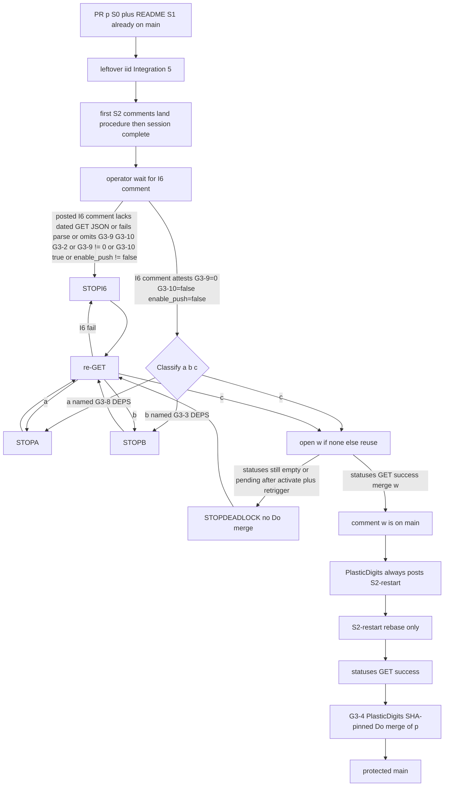
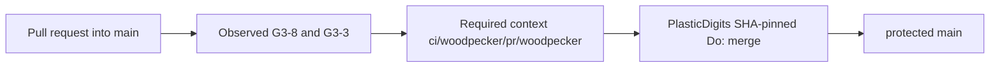

# Architecture overview

`code/gitlab-cursor-webhook` is **GCH** (GitLab Cloud Host): filter GitLab
webhooks and provision ephemeral Hetzner agent VMs that run the Cursor CLI.
Live product map (binaries, routes, filter rules, golden images, Terraform):
[`README.md`](../README.md). Docker/Coolify cutover:
[`docker-deploy.md`](docker-deploy.md). This file is the **merge gate** plus a
short runtime index. Do not copy README narrative here. Do not treat this file
as a second product architecture.

This tree is **not** the archival `PlasticDigits/gitlab-cursor-webhook`
(CAC invariant 21). Do not write that clone from here.

Catch-all `CODEOWNERS` removal is decided in
[ADR 0001](adr/0001-remove-catchall-codeowners.md)
([#3](https://git.cl8y.com/code/gitlab-cursor-webhook/issues/3)); do not
duplicate that narrative. **S1 is already on `main`.** Merge of
[`pulls/3`](https://git.cl8y.com/code/gitlab-cursor-webhook/pulls/3) at
`19bb806` (`merged: true`, `merged_at: 2026-09-21T13:10:05Z`, merger
`@PlasticDigits`) landed incomplete tip `022f4f5` (six-line delete only).
Issue `#3` is closed (`pull_request.merged: true`). Vehicle **B** is
**dead**. Do **not** restore `CODEOWNERS` to retry it. Do **not** use
closed `#3` / merged `pulls/3` as the land vehicle or leftover `{iid}`.

Remaining land vehicle is a **new** product PR `{p}` (docs + README G3
pointer only; S1 no-op; no `.woodpecker.yaml` in `{p}`). Design branch
`cac-design-issue-3` is transport only; do not open it as `{p}`. After
independent ACCEPT, pin that accepted hex on leftover `{iid}` (`iid != 3`,
`pull_request` absent) and on `{p}`; the product tip must satisfy
`git diff <accepted> -- docs/adr/0001-remove-catchall-codeowners.md docs/architecture.md`
empty. Do not treat `62ffd58` or `6e0852c` as copyable. Drop `Fixes #3`
as a close-gate: `#3` is already closed.

## Runtime

| Layer | Choice |
|-------|--------|
| App | Rust workspace: `gchcontroller` (HTTP), `gchconfig` (SQLite CLI), `gch-core` (filter/dedup/db). |
| Ingress | `POST /webhook` (Standard Webhooks HMAC). Job API for agent VMs. Admin API behind `GCH_ADMIN_TOKEN`. |
| Data | SQLite (`GCH_DB_PATH`) + per-job Terraform state under `GCH_JOBS_DIR`. |
| Host | Coolify/Docker (`Dockerfile`, [`docker-compose.yml`](../docker-compose.yml)); persist `/var/lib/gch`. Git-follow / auto-rebuild on `main`, `pull_request`, or any non-`main` ref is **not** recorded in-tree. |
| Agents | Isolated Terraform apply of [`terraform/modules/agent-vm/`](../terraform/modules/agent-vm/) from a golden snapshot. |
| Legacy CI file | [`.gitlab-ci.yml`](../.gitlab-ci.yml) is GitLab Secret Detection leftover. It does **not** post Forgejo Woodpecker context `ci/woodpecker/pr/woodpecker`. |



No Coolify rebuild edge: that follow is unverified in-tree (**G3-6**). HMAC
tokens, `HCLOUD_TOKEN`, `CURSOR_API_KEY`, job runtime tokens, and Coolify
UUID/auto-deploy are **not** this ticket
([agent-control #297](https://git.cl8y.com/PlasticDigits/cl8y-agent-control/issues/297)).

## Forgejo merge gate {#forgejo-merge-gate}

Official CODEOWNERS review is **not** a merge gate. Decision, slices, tests,
rollback: [ADR 0001](adr/0001-remove-catchall-codeowners.md). Host write-up:
[cl8y-forgejo#48](https://git.cl8y.com/PlasticDigits/cl8y-forgejo/issues/48)
and forgejo PR **#50** (`docs/INVARIANTS.md` + ADR 0003 item 8). Unauthenticated
HTML of `#48` / forgejo `docs/INVARIANTS.md` **404s**. The six-row table below
is **this repo’s host target** for `main`. Force-push (forge INVARIANTS item
2, “No force-push”) is omitted here and stays #48. Do not treat that table as
INVARIANTS **2–7**. Do not treat fleet / `code/hello` as this repo’s GET. Do
not fork INVARIANTS here. Deploy / spend / custody / policy expansion:
[agent-control #297](https://git.cl8y.com/PlasticDigits/cl8y-agent-control/issues/297)
— this ticket is none of those. Sister CAC autoland predicates are
[#429](https://git.cl8y.com/PlasticDigits/cl8y-agent-control/issues/429), not
this controller. CAC #429 does not merge `{p}`, predecessor `{w}`, or
plant-check `{n}`. Closed `#3` / merged `pulls/3` are not merge targets.
[hello#15](https://git.cl8y.com/code/hello/pulls/15) is the fleet canary, not
a local iid.

### Issue #3 body vs host flags

[`issues/3`](https://git.cl8y.com/code/gitlab-cursor-webhook/issues/3) is the
same number as [`pulls/3`](https://git.cl8y.com/code/gitlab-cursor-webhook/pulls/3)
(`pull_request` present, **closed**, `merged: true`). That body remains the
origin of the three standing bullets — not a six-row table, not **G3-*** IDs:

> Remove catch-all CODEOWNERS … Merge gate remains: no direct `main`,
> Woodpecker `ci/woodpecker/pr/woodpecker`, no `force_merge`. See
> cl8y-forgejo#48 and docs/INVARIANTS.md.

| Issue bullet | IDs |
| --- | --- |
| no direct `main` | **G3-2** (`enable_push == false`). `#3` does **not** own force-push (forge INVARIANTS item 2 / named #48). |
| Woodpecker `ci/woodpecker/pr/woodpecker` | **G3-8** ∧ **G3-3** (procedure below). Standing remaining CI gate; not “Woodpecker only under **(c)**.” |
| no `force_merge` | **G3-4** |

**G3-9**, **G3-10**, and **G3-5** are #48 / host flags. Issue `#3` did not
publish them. Keywords in that body are not architecture approval. Closed
`#3` is not leftover `{iid}` and is not land vehicle `{p}`.

“Maps only” those three bullets **cannot** mean skip I6: leftover official
requests remain on open Renovate
[#2](https://git.cl8y.com/code/gitlab-cursor-webhook/pulls/2) and historically
on closed `#3` (official `REQUEST_REVIEW` `id: 209`, not dismissed), so land
of `{p}` still requires the I6 attest of unpublished **G3-9** / **G3-10**
(and **G3-2**) even though those IDs are not in the `#3` body map.

### Merge gate (G3)

Three contract groups. The six-row table below is **this repo’s host target**
for `main` (readable with a repo token; unauthenticated HTML of `#48` /
INVARIANTS **404s**). It is **not** forge INVARIANTS **2–7** (item 2 is “No
force-push,” omitted here and assigned to #48). It is **not** text issue `#3`
published. It is **not** a measured GET of this repo pasted into S0.
Unauthenticated
`GET /api/v1/repos/code/gitlab-cursor-webhook/branch_protections` is **401**.
This tree has **no** dated protection JSON in-repo. Do not paste one from an
unauthenticated session. Requiring that GET in S0 would freeze design behind
a token this pass does not have. Fleet values / `code/hello` are not this
repo’s GET. `@PlasticDigits` still comments dated JSON of **this** repo on
leftover `{iid}` and on `{p}`. Classify **(a)** / **(b)** / **(c)** from
that dated GET **only after I6 attests**. I6 fail: an **I6 comment posted**
that lacks dated GET JSON (or fails parse / omits **G3-9** / **G3-10** /
**G3-2**) **or** that JSON shows **G3-9 ≠ 0** / **G3-10** `true` /
`enable_push != false` → **STOPI6**; do not classify through to **(c)**; do
not wait for `{w}`; do not `Do: merge`. **No I6 comment yet → operator
waits** (do not open `{w}`; do not post `S2-restart`). If I6 attests and
the GET is **(c)**, take the executable sequence below. If it is **(a)** or
**(b)**, **stop** (named DEPS; do not `Do: merge`).

The list endpoint returns an **array**; pick `rule_name == "main"` (or
`GET /api/v1/repos/code/gitlab-cursor-webhook/branch_protections/main`). A
green `cargo test`, a Coolify rebuild, empty commit statuses, or a GET on a
different `code/*` repo is **not** proof of any flag.

`origin/main` at `19bb806` has **no** `CODEOWNERS`, **no**
`docs/architecture.md`, **no** `docs/adr/`, **no** `.woodpecker.yaml`, and
README has no G3 pointer. Commit statuses on `19bb806` are `[]`. Incomplete
tip `022f4f5` and design SHA `9f8dec8` also had `[]`. Empty `[]` on
`19bb806` is the **same CI gap**, not a classification of **(a)** / **(b)**
/ **(c)**. Empty `[]` does not distinguish “no yaml” from “this repo is not
a Woodpecker project.” Classification waits on `@PlasticDigits`’s dated GET
on leftover `{iid}` and `{p}`. Standing **G3-8** ∧ **G3-3** still has **no
poster**: `{w}` remains required before merging `{p}` under **(c)**. The
`022f4f5` merge skipped merge-ready items 2–7; repair is `{p}` + leftover +
I6 + `{w}`, **not** a second delete.

**Observed vs target.** Leftover-complete **records** dated observed JSON and a
written vs-target diff **after (c)** land of `{p}` (the only merge path; see
Rollout in ADR 0001). Drift after that is a **#48 leftover**, not a GCH PATCH,
not a reason to restore `CODEOWNERS`, and **not** an S3 fail. Land still
fail-closes on **G3-9** / **G3-10** and on `enable_push != false` (**G3-2**)
via the same dated GET (ADR Tests item 7 / Integration item 6) while leftover
official requests remain (they do on open
[#2](https://git.cl8y.com/code/gitlab-cursor-webhook/pulls/2); closed `#3`
still shows planted `id: 209` and is **not** S3 evidence). Leftover-complete
does **not** fail on post-land **G3-2** drift (record-not-fail). S2 implement
does not perform the GET. Repo admin **comments** the GET body; see ADR 0001
actors.

#### Protection GET target (six flags)

**This repo’s host target** for `main`. Not forge INVARIANTS **2–7**. Force-push
stays [cl8y-forgejo#48](https://git.cl8y.com/PlasticDigits/cl8y-forgejo/issues/48).
Not a measured GET of `code/gitlab-cursor-webhook` pasted here. Not the
issue-`#3` body.

| ID | Flag | Target |
| --- | --- | --- |
| **G3-2** | `enable_push` | `false` (no direct push to `main`) |
| **G3-8** | `enable_status_check` | `true` |
| **G3-3** | `status_check_contexts` | `["ci/woodpecker/pr/woodpecker"]` (array **equal**, not subset) |
| **G3-9** | `required_approvals` | `0` |
| **G3-10** | `block_on_official_review_requests` | `false` |
| **G3-5** | `block_on_rejected_reviews` | `true` |

Merge procedure is not a protection field.

**G3-2** target is `enable_push == false` (issue `#3` bullet “no direct
`main`”). `#3` does **not** own force-push: forge INVARIANTS item 2 (“No
force-push”), force-push allowlist fields (if the host exposes them), and
`apply_to_admins` stay
[cl8y-forgejo#48](https://git.cl8y.com/PlasticDigits/cl8y-forgejo/issues/48).
Land of `{p}` fail-closes if the dated GET shows `enable_push != false`.
Leftover-complete does **not** require a **G3-2** match for S3 pass
(record-not-fail on post-land drift).

A leftover official CODEOWNERS request on an open PR (including `#2`, and
`{w}` / `{p}` **if** planted) is non-blocking **only after** repo admin
**comments** dated GET JSON of **this** repo’s `main` rule showing **G3-9**,
**G3-10**, and **G3-2** (`enable_push == false`) on leftover `{iid}`
(`iid != 3`) **and** on `{p}`. Never call `#3` the leftover. S1 already
deleted the file, so new PRs against current `main` may **not** be planted;
I6 still attests **G3-9** / **G3-10** / **G3-2**. If an **I6 comment is
posted** that lacks dated GET JSON (or fails parse / omits **G3-9** /
**G3-10** / **G3-2**), or that JSON shows
`block_on_official_review_requests` still `true`, `required_approvals != 0`,
or `enable_push != false`, merge is 405, still review-gated, or would allow
direct `main`; stop; that mismatch is a **named** local/host DEPS (canonical
land procedure below). **No I6 comment yet → operator waits.** Do not
`force_merge`. Do not infer those flags from fleet #48. S2 does not GET.

##### One Woodpecker land rule (canonical land procedure)

Canonical procedure for ADR Decision 7, Tests item 9, land criterion 7, the
**land-of-`{p}`** diagram, and the `{p}` body. ADR Decision 7 **points
here**; it does not paste a second wait table. Host CI is not an in-diff
deliverable of `{p}`. This tree has **no** `.woodpecker.yaml` on `main` at
`19bb806`. Statuses on `19bb806` / `022f4f5` / `9f8dec8` are **empty**
(`[]`) — CI gap only. `.gitlab-ci.yml` does not post
`ci/woodpecker/pr/woodpecker`. Do not add `.woodpecker.yaml` in the `{p}`
diff. Do not add `.woodpecker/`. Do not fake statuses. Do not `force_merge`.
Do not comment this procedure onto closed `pulls/3`. Do not wait for I6 on
closed `#3`.

**Standing gate** (issue `#3` body, and after land): Woodpecker context
`ci/woodpecker/pr/woodpecker` is the remaining CI gate (**G3-8** ∧ **G3-3**
host target). This rule does **not** rewrite that as “Woodpecker only under
**(c)**.” **(a)** / **(b)** are distinct **stop** reasons if a dated GET of
**this** repo’s `main` rule disagrees with that target. Merge of `{p}` is
**only** under **(c)**. `{w}` remains required before that merge: standing
**G3-8** ∧ **G3-3** still has no poster.

Classify only **(a)** / **(b)** / **(c)**. Do not collapse **(a)** and
**(b)**. Do not merge `{p}` on **(a)** or **(b)**. XOR is **I6 fail else
classify (a|b|c)** only. Deadlock is a **statuses** path **after (c)**, not
an XOR sibling.

**First-session S2 is complete after leftover + this comment.** First-session
S2 opens `{p}` (docs + README G3 pointer; S1 no-op), opens leftover `{iid}`,
comments this procedure on `{p}`, then **stops**. That session is
**complete**. It is **not** a waiter. There is **no wait-table item 2**.
Drain-skip / first-session exit ≠ skip rebase, ≠ add yaml to `{p}`, ≠
`Do: merge`. Issue `#3` already has `drain skip: no occupying job for
rebase/fix-pr/CI-wait`; that is **#429**, not a `#3` / `{p}` failure.

**Only S2-restart rebases.** Never first-session S2. Never both. After `{w}`
is on `main`, `@PlasticDigits` **always** posts `S2-restart` on `{p}` and
queues `implement` (happy path **and** post-STOP). `@PlasticDigits` is
**not** the rebaser.

Repo admin dated GET JSON of **this** repo’s `main` rule (same GET as
**G3-9** / **G3-10** / **G3-2**; S2 does not perform it). I6 fail is a
**posted** I6 comment that lacks dated GET JSON, fails parse, omits
**G3-9** / **G3-10** / **G3-2**, or shows **G3-9 ≠ 0** / **G3-10** `true`
/ `enable_push != false` — not these bullets. **No I6 comment yet →
operator waits.** Classify **(a)** / **(b)** / **(c)** only after I6
attests:

- **(a)** `enable_status_check != true` or the field is absent → **G3-8**
  drift. Record a **named** **G3-8** DEPS (cl8y-forgejo iid or a local issue
  that is **not** leftover `{iid}`; parity with **(b)**). **Stop. Do not
  `Do: merge`.** Do not wait for `{w}`. Do not wait on Woodpecker as a
  substitute for that stop. Distinct from **(b)**. This is not a rewrite of
  the issue body.
- **(b)** `enable_status_check == true` and `status_check_contexts` is
  **not** equal to `["ci/woodpecker/pr/woodpecker"]` → **G3-3** drift.
  Record a **named** **G3-3** DEPS (same iid rules as **(a)**). **Stop. Do
  not `Do: merge`.** Do not wait for `{w}`. Distinct from **(a)**. Do not
  merge after recording the DEPS iid alone, and do not merge after
  observed-context success either: land of `{p}` is **(c)** only.
- **(c)** `enable_status_check == true` **and** `status_check_contexts`
  equals `["ci/woodpecker/pr/woodpecker"]`. The host requires that context
  on the product-tip SHA. Merge of `{p}` **only** under **(c)**. Clearing
  **G3-8** / **G3-3** is forge `#48` / founder, **not** a `{p}` land option.
  Do not document a ticket that relaxes those rows. Unstick is: get
  `ci/woodpecker/pr/woodpecker` **success** on the product-tip SHA, or
  **stop**. Mixed **(c)**-on-G3-8/G3-3 + I6-fail stays **STOPI6 only**.

  **Executable (c) sequence** for this repo (post the context **before**
  merge; do not “block until green, then unstick”). No **may**. Item 7
  **(c)** is `{w}` merged under statuses GET success → **S2-restart**
  rebase → statuses GET success (steps 1–4). Step 5 / **G3-4** is after
  merge-ready items 1–6 **and** item 7 **(c)** only (I6 fail, **(a)**,
  **(b)**, and deadlock are stop states, not land criteria):

  1. **Operator preconditions, then who posts.** Before expecting statuses
     on `{w}`: **`@PlasticDigits`** activates `code/gitlab-cursor-webhook`
     in Woodpecker, turns **Allow pull requests** on, and has an agent
     online. If `{w}` was opened first, retrigger. These are operator
     preconditions, **not** leftover `{iid}`, **not** a ticket that clears
     **G3-8** / **G3-3**. Per-branch yaml read is true; it does **not**
     activate the repo, install the Forgejo webhook, turn on Allow pull
     requests, or put a runner online. Empty `[]` does not distinguish “no
     yaml” from “this repo is not a Woodpecker project.” Empty `[]` on
     `19bb806` is that gap, not a classification.

     Human owner who authors the first in-repo pipeline:
     **`@PlasticDigits`**. Opens predecessor PR `{w}` in **this** repo only
     (`iid != 3`, `{w}` is not leftover `{iid}`, `{w}` is not `{p}`) whose
     tip **adds** root `.woodpecker.yaml` (**not** `.woodpecker/`). `{w}`
     is opened **after** Integration item 6 attests **G3-10**=false. S1
     already deleted `CODEOWNERS` on `main`, so `{w}` **may not** be
     planted; if it is planted, that leftover request is non-blocking
     **only** under the same I6 attest (no CAC dismiss). **S2 never merges
     `{w}`.** CAC #429 does not merge `{w}`. Woodpecker reads the pipeline
     from `{w}`’s own **tree**, so `{w}` does not need yaml on `main`
     first.

     **Allowed `{w}` file** — only this shape. Land of `{w}` **fails
     review** if the yaml is not this shape. Still not in the `{p}` diff.
     Do **not** copy `code/hello`. `when` is **only** `pull_request` so the
     posted name is **exactly** `ci/woodpecker/pr/woodpecker` (a
     `.woodpecker/ci.yaml` posts `ci/woodpecker/pr/ci`; `when:` of `push`
     posts `…/push/woodpecker`). Do **not** also attach Coolify-on-`push` /
     `main`. Required step: gitleaks against existing `.gitleaks.toml`.
     Forbid `echo`-only commands, `coolify`, `deploy`, Terraform, Hetzner,
     compose, tokens, auto-deploy. Optional `cargo test` / `clippy` only
     with the named image below (known to have the toolchain; matches
     `Dockerfile` `rust:1.88-bookworm`; not implementer choice). Woodpecker
     1.x `pipeline:` instead of `steps:` is the same shape if `when` and
     the steps match.

     ```yaml
     when:
       - event: pull_request

     steps:
       - name: gitleaks
         image: zricethezav/gitleaks:v8.24.3
         commands:
           - gitleaks detect --source . --config .gitleaks.toml --verbose --no-git
     ```

     Optional extra steps **only** these, **only** this image:

     ```yaml
       - name: cargo-test
         image: rust:1.88-bookworm
         commands:
           - cargo test
       - name: clippy
         image: rust:1.88-bookworm
         commands:
           - rustup component add clippy
           - cargo clippy -- -D warnings
     ```

     **`@PlasticDigits` records `{w}` on `{p}` when opening it.** A
     leftover “enable/post” issue with no posting workflow is **not**
     sufficient DEPS.
  2. **Who merges `{w}` (same (c) rule).** `{w}` is under the same required
     context as `{p}`. Owner of activation remains **`@PlasticDigits`**.
     Merger: **`@PlasticDigits`** after
     `GET /api/v1/repos/code/gitlab-cursor-webhook/statuses/{w-tip-sha}`
     includes `ci/woodpecker/pr/woodpecker` in a **success** state, then
     SHA-pinned `Do: merge`. **S2 never merges `{w}`.** CAC #429 does not
     merge `{w}`. Do not `force_merge`. Do not clear **G3-8** / **G3-3** to
     land `{w}`. `{w}`’s planted official request (if any) is non-blocking
     only under the same I6 attest (no CAC dismiss). Planted official
     request on `{w}` is non-blocking only under I6; do not merge `{w}`
     from a post-STOP reuse before re-GET attests I6 **and** **(c)**.

     If after activate + Allow PRs + agent online + retrigger,
     `GET .../statuses/{w-tip-sha}` is still `[]` or `pending`: comment
     **deadlock** on `{p}`. **STOPDEADLOCK** (do not wait for `{w}` on
     `main`; do not `Do: merge`). Diagnose activation / webhook / runner /
     `when` / filename is how `@PlasticDigits` writes that comment — not
     leftover `{iid}`, not a ticket that clears **G3-8** / **G3-3**. If
     Woodpecker ACL/server is outside this repo, record a **named** infra
     DEPS (not leftover `{iid}`, not a ticket that clears **G3-8** /
     **G3-3**). Land stays blocked until statuses success. Restart after
     deadlock **reuses** the existing `{w}` **after** re-GET **(c)**; do
     not open a second `{w}`.
  3. **`{p}` needs a new push. Only S2-restart rebases.**
     `@PlasticDigits` comments on `{p}` that `{w}` is on `main` (**(c)**
     only), **then always** posts `S2-restart` on `{p}` quoting the
     S2-restart recipe and queues a CAC `implement` job for
     `code/gitlab-cursor-webhook` `{p}` with that comment as the prompt
     (happy path **and** post-STOP). Do not wait for GitLab
     `agent:implement`. CAC #429 does not queue it. There is **no**
     first-session resume. **Only S2-restart** rebases `{p}` onto that
     `main` and **pushes** (new product-tip SHA). Never first-session S2.
     Never both. Rebase is load-bearing: Woodpecker reads the **tree** of
     the new SHA, not the diff vs `main`. **S2-restart gates after
     rebase:** `HEAD:.woodpecker.yaml` exists (inherited from `main`)
     **and** `git diff origin/main -- .woodpecker.yaml` is empty. Do not
     add yaml in replayed `{p}` commits. Do not empty-commit `022f4f5`
     (already merged; no yaml in that tree). Do not restore `CODEOWNERS`.
     The `{p}` diff vs `main` still must **not** add `.woodpecker.yaml`.
     If Woodpecker does not post after that push, **stop**.
  4. `GET /api/v1/repos/code/gitlab-cursor-webhook/statuses/{new-product-tip-sha}`
     shows `ci/woodpecker/pr/woodpecker` in a **success** state.
  5. **`@PlasticDigits`** SHA-pinned `Do: merge` of `{p}` after
     merge-ready items 1–6 **and** item 7 **(c)** only. Item 7 **(c)**
     **is** `{w}` merged under statuses GET success → S2-restart rebase →
     statuses GET success (steps 1–4). Step 5 **is** the merge
     (**G3-4**). I6 fail, **(a)**, **(b)**, and deadlock are stop
     states, not land criteria. S2 never merges `{p}`, `#3`, or `{w}`.

**Post-STOP sequence (option B; same as the land diagram).** After STOPI6 /
STOPA / STOPB / STOPDEADLOCK, first-session S2 is already complete. Do
**not** re-enter it. Do **not** re-enter operator WAITI6. Do **not** “run
steps 1–4, then comment `{w}` is on `main`.” Executable step 3 **is** that
comment; step 4 needs the new product-tip SHA. `@PlasticDigits` is not the
rebaser.

1. `@PlasticDigits` **re-GETs** this repo’s `main` rule onto leftover
   `{iid}` and `{p}`. I6 fail again → **STOPI6**. Still **(a)** / **(b)**
   → **STOPA** / **STOPB**. Do not start S2-restart. Do not merge `{w}`
   before this re-GET attests I6 **and** **(c)** (planted official request
   on `{w}` is non-blocking only under I6).
2. If **(c)** and **no** `{w}` exists (prior stop was I6 fail / **(a)** /
   **(b)**): executable steps **1–2 only** (open `{w}`, merge under
   statuses GET success).
3. If **(c)** and `{w}` is already open from deadlock: **reuse that PR**;
   do not open a second `{w}`; finish step 2 (merge under statuses GET
   success).
4. `@PlasticDigits` comments `{w}` is on `main`.
5. **Always** post `S2-restart` on `{p}` and queue `implement`. Launch
   **after** that comment; S2-restart rebases **immediately** because
   `{w}` is already on `main`. CAC #429 does not launch it.

**S2-restart recipe.** Leftover `{iid}` is already recorded on `{p}`. Do
not open another leftover. Do not re-comment this land procedure as a new
wait. Do not re-enter first-session S2. Rebase immediately onto `main`.
Gates: `HEAD:.woodpecker.yaml` exists **and**
`git diff origin/main -- .woodpecker.yaml` is empty. Stop for **G3-4**.
Never merge `{p}`, `#3`, or `{w}`.

File-delete + docs on the tip does not satisfy **(c)**. There is no “when
one exists” hedge. Docs on `{p}` without `{w}` does not satisfy **(c)**.

#### Merge procedure

| ID | Rule |
| --- | --- |
| **G3-4** | SHA-pinned `Do: merge` with `head_commit_id`. Never document or use `force_merge`. **Land of `{p}`:** actor `@PlasticDigits` after ADR merge-ready items 1–6 **and** item 7 **(c)** only (item 7 **(c)** **is** Decision 7 **(c)**: `{w}` statuses success → **S2-restart** rebase → statuses GET; step 5 **is** this merge). I6 fail, **(a)**, **(b)**, and deadlock are stop states, not land criteria. **S2 never merges `{p}`**. **Predecessor `{w}`:** actor `@PlasticDigits`; **S2 never merges `{w}`**. **Standing after land:** actor `@PlasticDigits`; no leftover `{iid}` attest. CAC [#429](https://git.cl8y.com/PlasticDigits/cl8y-agent-control/issues/429) does not merge `{p}`, `{w}`, `{n}`, or closed `#3`. |

#### Tree contracts

| ID | Rule |
| --- | --- |
| **G3-1** | `test -f` fails on `CODEOWNERS`, `docs/CODEOWNERS`, `.gitea/CODEOWNERS`, and `.forgejo/CODEOWNERS`. Already true on `19bb806`. Do not restore the file. |
| **G3-6** | This Coolify app **may** rebuild if the existing host is git-follow on `main` (not verified in-tree). [`docker-compose.yml`](../docker-compose.yml) and [`docker-deploy.md`](docker-deploy.md) only record Dockerfile deploy plus `/var/lib/gch`. They do **not** record git-follow, auto-deploy, rebuild-on-`main`, or Coolify builds on `pull_request` / non-`main`. This ticket does not add PR deploys, rotate tokens/UUIDs, or edit `Dockerfile` / `docker-compose.yml` / entrypoint. A rebuild is not leftover-complete and is not a #297 grant. **Happy-path plant-check `{n}`:** ADR 0001 Tests item 4 — **mandatory sandwich**: open **WIP/draft** → strip WIP / mark ready → **GET immediately** (pass GET `draft == false`, no WIP prefix) → **re-apply WIP immediately** → close unmerged in the same session. Do **not** open ready-first. Empty draft GET is not a pass; present on draft still fails. Record the **ready** GET pair, not the re-WIP GET. Residual race ready → re-WIP is still open to a poller; `do-not-merge` is a comment, not a host-block; CAC #429 prose is not a mutex. If `{n}` merges, leftover-complete **fails**; revert via PR. Coolify secrets never attach to `pull_request` events. |
| **G3-7** | This tree does not expand CAC merge/deploy/spend/custody policy. |

Forgejo loads the first existing file among `CODEOWNERS`, `docs/CODEOWNERS`,
`.gitea/CODEOWNERS`, and `.forgejo/CODEOWNERS` (Go-regexp, not GitHub globs;
`.forgejo/` added in forgejo#8773; `.gitea/` remains in the walk). After
ADR 0001 S1, **G3-1** holds on `main`. None of those four paths may contain a
reviewer rule for any pattern (ADR 0001 Decision 2). Do not leave an empty or
comments-only file; Forgejo still parses it. Do not restore the file to retry
Vehicle **B**.

##### Land of {p} (not standing; not closed #3)

Leftover `{iid}` with two `@login`s, then first-session S2 **complete**, then
I6 protection GET, then Decision 7 classify **(a)** / **(b)** / **(c)**
**only on the I6 attest edge**. Two GETs: **protection** fail-closes I6
**or** classifies; **statuses** unsticks **(c)** (including deadlock). Merge
**only** under **(c)** (`{w}` merged under statuses success → **S2-restart**
rebase → statuses GET success → **G3-4**). I6 fail: posted I6 comment that
lacks dated GET JSON, fails parse, omits **G3-9** / **G3-10** / **G3-2**, or
shows **G3-9 ≠ 0** / **G3-10** `true` / `enable_push != false` → **STOPI6**,
do not wait for `{w}`, do not `Do: merge`, do not classify through to
**(c)**. **No I6 comment yet → operator waits.** **(a)** / **(b)** are
classify stops. Deadlock is nested under **(c)** / statuses GET:
**STOPDEADLOCK**. Merger is **`@PlasticDigits`**. S2 never merges `{p}`,
`#3`, or `{w}`. `{p}` must not `Fixes #3` (already closed). Land uses this
diagram only. Same procedure as Decision 7 (pointer), Tests item 9, and land
criterion 7. Merge-ready is Integration items 1–6 **and** item 7 **(c)**
only.



I6 is a **decision** after an I6 comment is posted: fail-close when that
comment lacks dated GET JSON (or fails parse / omits **G3-9** /
**G3-10** / **G3-2**) **or** the JSON shows **G3-9 ≠ 0**, **G3-10**
`true`, or `enable_push != false` (**G3-2**) → **STOPI6**, named DEPS
(do not wait for `{w}`; do not `Do: merge`; do not classify through to
**(c)**). **No I6 comment yet → operator waits** (WAITI6). Same GET can
be **(c)** on **G3-8** / **G3-3** and fail on **G3-9** / **G3-10** /
**G3-2**; the fail edge is **STOPI6** only, not merge. **STOPA** /
**STOPB** are distinct classify-stop nodes (do not `Do: merge`).
**STOPDEADLOCK** is nested under **(c)** / statuses GET: `{w}` statuses
still `[]` or `pending` after activate + retrigger; no `Do: merge`.
Restart after deadlock **re-GETs first**, then reuses `{w}` **only if**
that GET is **(c)** (I6 attested); then comment `{w}` on `main`; **then**
`S2-restart`. Do **not** re-enter first-session S2. Do **not** loop STOP*
through WAITI6. Do not reuse `{w}` into WAITI6 (that would merge `{w}`
before I6 re-attest).

**(c)** after a stop is **not** “run steps 1–4, then comment.” Post-STOP
nodes match option B: `re-GET` → STOPI6 / STOPA / STOPB **or** open/reuse
`{w}` → comment `{w}` on `main` → `S2-restart`. This `{p}` diff must not
add `.woodpecker.yaml`.

##### Standing merge after land (not the {p} checklist)

Observed **G3-8** ∧ **G3-3** without leftover `{iid}`. Merge-ready items
1–6 **and** item 7 **(c)** are land-of-`{p}` only, not the forever **G3-4**
contract. Standing after land
uses this diagram only.



`cargo test` / `cargo clippy` are contributor checks, not **G3-3**.

This tree does not change Forgejo protection JSON, CAC autoland predicates, or
Coolify app config. Those remain
[cl8y-forgejo#48](https://git.cl8y.com/PlasticDigits/cl8y-forgejo/issues/48),
[cl8y-agent-control#429](https://git.cl8y.com/PlasticDigits/cl8y-agent-control/issues/429),
and [agent-control #297](https://git.cl8y.com/PlasticDigits/cl8y-agent-control/issues/297)
respectively.

## Directory (agents)

```
crates/gchcontroller/  HTTP webhook + job API + Terraform provision
crates/gchconfig/      SQLite CLI
crates/gch-core/       filter, dedup, db, prompt render
terraform/             firewall + agent-vm module
docs/adr/              versioned decisions
docs/architecture.md   this file (merge gate G3; not product architecture)
README.md              product map
docs/docker-deploy.md  Coolify cutover
docs/admin-golden-image.md
.gitlab-ci.yml         GitLab leftover; not the Forgejo merge context
```

## ADRs

| ADR | Topic |
|-----|-------|
| [0001](adr/0001-remove-catchall-codeowners.md) | Remove catch-all CODEOWNERS ([#3](https://git.cl8y.com/code/gitlab-cursor-webhook/issues/3); land remaining work on `{p}`) |
