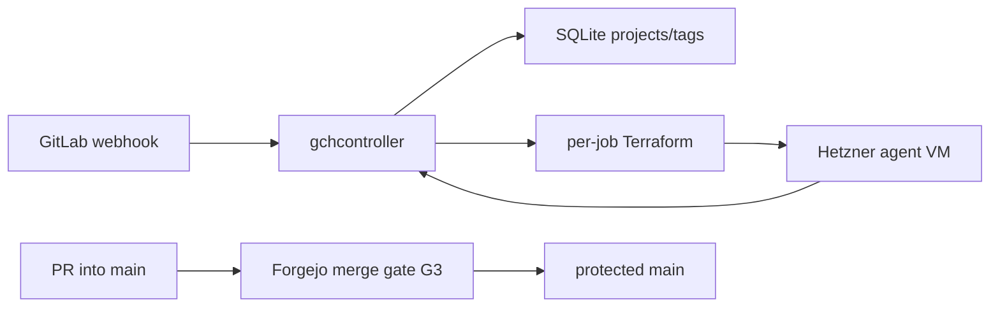
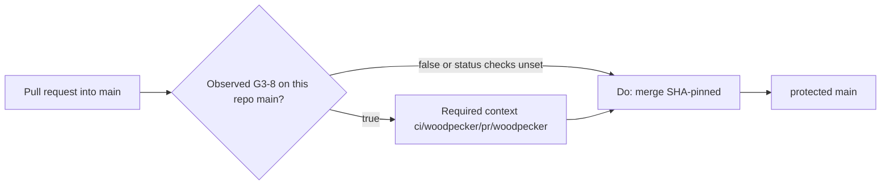

# Architecture overview

`code/gitlab-cursor-webhook` is **GCH** (GitLab Cloud Host): filter GitLab
webhooks and provision ephemeral Hetzner agent VMs that run the Cursor CLI.
Live product map (binaries, routes, filter rules, golden images, Terraform):
[`README.md`](../README.md). Docker/Coolify cutover:
[`docker-deploy.md`](docker-deploy.md). This file is the **merge gate** plus a
short runtime index. Do not copy README narrative here. Do not treat this file
as a second product architecture.

This tree is **not** the archival `PlasticDigits/gitlab-cursor-webhook`
(CAC invariant 21). Do not write that clone from here.

Catch-all `CODEOWNERS` removal is decided in
[ADR 0001](adr/0001-remove-catchall-codeowners.md)
([#3](https://git.cl8y.com/code/gitlab-cursor-webhook/issues/3)); do not
duplicate that narrative. Vehicle **B** copies this file and ADR 0001 onto the
product PR so `main` holds the standing contract. Design branch
`cac-design-issue-3` is transport only.

## Runtime

| Layer | Choice |
|-------|--------|
| App | Rust workspace: `gchcontroller` (HTTP), `gchconfig` (SQLite CLI), `gch-core` (filter/dedup/db). |
| Ingress | `POST /webhook` (Standard Webhooks HMAC). Job API for agent VMs. Admin API behind `GCH_ADMIN_TOKEN`. |
| Data | SQLite (`GCH_DB_PATH`) + per-job Terraform state under `GCH_JOBS_DIR`. |
| Host | Coolify/Docker (`Dockerfile`, [`docker-compose.yml`](../docker-compose.yml)); persist `/var/lib/gch`. Git-follow / auto-rebuild on `main` is **not** recorded in-tree. |
| Agents | Isolated Terraform apply of [`terraform/modules/agent-vm/`](../terraform/modules/agent-vm/) from a golden snapshot. |
| Legacy CI file | [`.gitlab-ci.yml`](../.gitlab-ci.yml) is GitLab Secret Detection leftover. It does **not** post Forgejo Woodpecker context `ci/woodpecker/pr/woodpecker`. |



No Coolify rebuild edge: that follow is unverified in-tree (**G3-6**). HMAC
tokens, `HCLOUD_TOKEN`, `CURSOR_API_KEY`, job runtime tokens, and Coolify
UUID/auto-deploy are **not** this ticket
([agent-control #297](https://git.cl8y.com/PlasticDigits/cl8y-agent-control/issues/297)).

## Forgejo merge gate {#forgejo-merge-gate}

Official CODEOWNERS review is **not** a merge gate. Decision, slices, tests,
rollback: [ADR 0001](adr/0001-remove-catchall-codeowners.md). Host write-up:
[cl8y-forgejo#48](https://git.cl8y.com/PlasticDigits/cl8y-forgejo/issues/48)
and forgejo PR **#50** (`docs/INVARIANTS.md` + ADR 0003 item 8). The issue body
points at forgejo `docs/INVARIANTS.md`, not a file in this tree. A 404 on
forgejo `main` for that file does not mean the policy is missing. Do not fork
INVARIANTS here. Deploy / spend / custody / policy expansion:
[agent-control #297](https://git.cl8y.com/PlasticDigits/cl8y-agent-control/issues/297)
— this ticket is none of those. Sister CAC autoland predicates are
[#429](https://git.cl8y.com/PlasticDigits/cl8y-agent-control/issues/429), not
this controller. [hello#15](https://git.cl8y.com/code/hello/pulls/15) is the
fleet canary, not a local iid.

### Merge gate (G3)

Three contract groups. The six-row table below is the issue-body /
[cl8y-forgejo#48](https://git.cl8y.com/PlasticDigits/cl8y-forgejo/issues/48)
**target** for this repo’s `main` rule. It is **not** a measured GET of this
repo. Unauthenticated
`GET /api/v1/repos/code/gitlab-cursor-webhook/branch_protections` is **401**.
This tree has **no** dated protection JSON. Do not paste one from an
unauthenticated session. Requiring that GET in S0 would freeze design behind a
token this pass does not have. Fleet values / `code/hello` are not proof.

The list endpoint returns an **array**; pick `rule_name == "main"` (or
`GET /api/v1/repos/code/gitlab-cursor-webhook/branch_protections/main`). A
green `cargo test`, a Coolify rebuild, empty commit statuses, or a GET on a
different `code/*` repo is **not** proof of any flag.

**Observed vs target.** Leftover-complete attests **observed** JSON and
compares it to this target. Drift is a **#48 leftover**, not a GCH PATCH, not
a reason to restore `CODEOWNERS`. Drift is not a land blocker except
**G3-9** / **G3-10** while leftover official requests remain (they do on
[#3](https://git.cl8y.com/code/gitlab-cursor-webhook/pulls/3) and
[#2](https://git.cl8y.com/code/gitlab-cursor-webhook/pulls/2)). S2 implement
does not perform the GET. Repo admin POSTs dated JSON; see ADR 0001 actors.

#### Protection GET target (six flags)

Issue-body / forge #48 **target**. Not a measured GET of `code/gitlab-cursor-webhook`.

| ID | Flag | Target |
| --- | --- | --- |
| **G3-2** | `enable_push` | `false` (no direct push to `main`) |
| **G3-8** | `enable_status_check` | `true` |
| **G3-3** | `status_check_contexts` | `["ci/woodpecker/pr/woodpecker"]` (array **equal**, not subset) |
| **G3-9** | `required_approvals` | `0` |
| **G3-10** | `block_on_official_review_requests` | `false` |
| **G3-5** | `block_on_rejected_reviews` | `true` |

Merge procedure is not a protection field.

**G3-2** target is `enable_push == false` only. It does **not** mean “no
force-push.” Force-push allowlist fields (if the host exposes them) and
`apply_to_admins` stay
[cl8y-forgejo#48](https://git.cl8y.com/PlasticDigits/cl8y-forgejo/issues/48),
not this ticket.

A leftover official CODEOWNERS request on an open PR (including #3 and #2) is
non-blocking **only after** repo admin POSTs dated JSON of **this** repo’s
`main` rule showing **G3-9** and **G3-10** on the leftover issue **and** on
`#3`. If `block_on_official_review_requests` is still `true` here, or that
JSON is missing, merge is 405. Stop. Do not `force_merge`. Do not infer those
two flags from fleet #48. S2 does not GET.

##### One Woodpecker land rule (observed G3-8, not the target row)

Host CI is not an in-diff deliverable. This tree had **no** `.woodpecker.yaml`
/ `.woodpecker/` on `main` when #3 was filed; commit `022f4f5` had **empty**
commit statuses (`[]`). `.gitlab-ci.yml` does not post
`ci/woodpecker/pr/woodpecker`. Do not add `.woodpecker.yaml` / `.woodpecker/`
in the #3 diff. Do not fake statuses. Do not `force_merge`.

Repo admin dated JSON of **this** repo’s `main` rule (same GET as **G3-9** /
**G3-10**; S2 does not perform it):

- If **G3-8** is `true`: S2 opens a named Forgejo **issue** (not a PR) in
  `code/gitlab-cursor-webhook` whose only job is enable/post
  `ci/woodpecker/pr/woodpecker`; record that iid on `#3`; it **is** a local
  DEPS; do not merge `#3` until that context is green on the product tip.
- If **G3-8** is `false` or status checks unset: land of `#3` does **not**
  wait on Woodpecker. Leftover-complete records observed flags vs this
  target. Do not PATCH protection from this tree.

File-delete + docs on the tip does not satisfy **G3-8**. There is no “when
one exists” hedge.

#### Merge procedure

| ID | Rule |
| --- | --- |
| **G3-4** | SHA-pinned `Do: merge` with `head_commit_id`. Never document or use `force_merge`. |

#### Tree contracts

| ID | Rule |
| --- | --- |
| **G3-1** | `test -f` fails on `CODEOWNERS`, `docs/CODEOWNERS`, `.gitea/CODEOWNERS`, and `.forgejo/CODEOWNERS`. |
| **G3-6** | This Coolify app **may** rebuild if the existing host is git-follow on `main` (not verified in-tree: [`docker-compose.yml`](../docker-compose.yml) and [`docker-deploy.md`](docker-deploy.md) only record Dockerfile deploy plus `/var/lib/gch`; they do not record git-follow, auto-deploy, or rebuild-on-`main`). This ticket does not add PR deploys, rotate tokens/UUIDs, or edit `Dockerfile` / `docker-compose.yml` / entrypoint. A rebuild is not leftover-complete and is not a #297 grant. Plant-check still **close without merge**. Coolify secrets never attach to `pull_request` events. |
| **G3-7** | This tree does not expand CAC merge/deploy/spend/custody policy. |

Forgejo loads the first existing file among `CODEOWNERS`, `docs/CODEOWNERS`,
`.gitea/CODEOWNERS`, and `.forgejo/CODEOWNERS` (Go-regexp, not GitHub globs;
`.forgejo/` added in forgejo#8773; `.gitea/` remains in the walk). After
ADR 0001, **G3-1** holds. None of those four paths may contain a reviewer rule
for any pattern (ADR 0001 Decision 2). Do not leave an empty or comments-only
file; Forgejo still parses it.



Standing merge procedure after vehicle **B**. The Woodpecker wait follows
**observed** **G3-8** from a dated admin GET of **this** repo, not the six-row
**target**. If observed **G3-8**, land of `#3` requires the named local CI
issue (ADR 0001 Decision 7) and does not merge until that context is green.
`cargo test` / `cargo clippy` are contributor checks, not **G3-3**.

This tree does not change Forgejo protection JSON, CAC autoland predicates, or
Coolify app config. Those remain
[cl8y-forgejo#48](https://git.cl8y.com/PlasticDigits/cl8y-forgejo/issues/48),
[cl8y-agent-control#429](https://git.cl8y.com/PlasticDigits/cl8y-agent-control/issues/429),
and [agent-control #297](https://git.cl8y.com/PlasticDigits/cl8y-agent-control/issues/297)
respectively.

## Directory (agents)

```
crates/gchcontroller/  HTTP webhook + job API + Terraform provision
crates/gchconfig/      SQLite CLI
crates/gch-core/       filter, dedup, db, prompt render
terraform/             firewall + agent-vm module
docs/adr/              versioned decisions
docs/architecture.md   this file (merge gate G3; not product architecture)
README.md              product map
docs/docker-deploy.md  Coolify cutover
docs/admin-golden-image.md
.gitlab-ci.yml         GitLab leftover; not the Forgejo merge context
```

## ADRs

| ADR | Topic |
|-----|--------|
| [0001](adr/0001-remove-catchall-codeowners.md) | Remove catch-all CODEOWNERS ([#3](https://git.cl8y.com/code/gitlab-cursor-webhook/issues/3)) |
