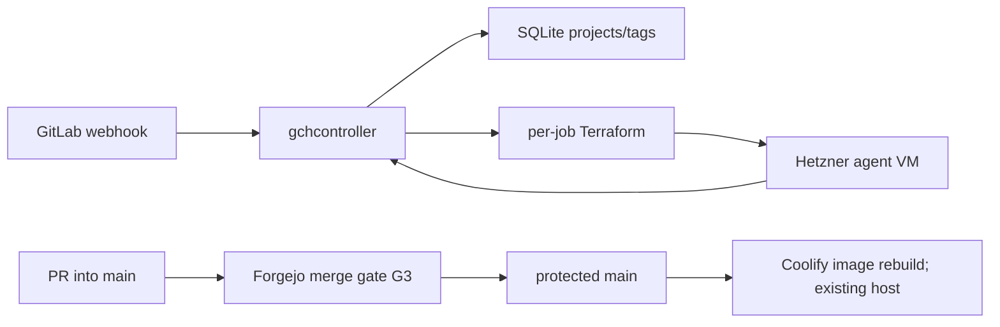
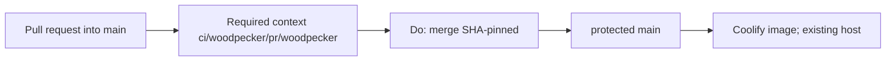

# Architecture overview

`code/gitlab-cursor-webhook` is **GCH** (GitLab Cloud Host): filter GitLab
webhooks and provision ephemeral Hetzner agent VMs that run the Cursor CLI.
Live product map (binaries, routes, filter rules, golden images, Terraform):
[`README.md`](../README.md). Docker/Coolify cutover:
[`docker-deploy.md`](docker-deploy.md). This file is the **merge gate** plus a
short runtime index. Do not copy README narrative here. Do not treat this file
as a second product architecture.

This tree is **not** the archival `PlasticDigits/gitlab-cursor-webhook`
(CAC invariant 21). Do not write that clone from here.

Catch-all `CODEOWNERS` removal is decided in
[ADR 0001](adr/0001-remove-catchall-codeowners.md)
([#3](https://git.cl8y.com/code/gitlab-cursor-webhook/issues/3)); do not
duplicate that narrative. Vehicle **B** copies this file and ADR 0001 onto the
product PR so `main` holds the standing contract. Design branch
`cac-design-issue-3` is transport only.

## Runtime

| Layer | Choice |
|-------|--------|
| App | Rust workspace: `gchcontroller` (HTTP), `gchconfig` (SQLite CLI), `gch-core` (filter/dedup/db). |
| Ingress | `POST /webhook` (Standard Webhooks HMAC). Job API for agent VMs. Admin API behind `GCH_ADMIN_TOKEN`. |
| Data | SQLite (`GCH_DB_PATH`) + per-job Terraform state under `GCH_JOBS_DIR`. |
| Host | Coolify/Docker (`Dockerfile`, [`docker-compose.yml`](../docker-compose.yml)); persist `/var/lib/gch`. |
| Agents | Isolated Terraform apply of [`terraform/modules/agent-vm/`](../terraform/modules/agent-vm/) from a golden snapshot. |
| Legacy CI file | [`.gitlab-ci.yml`](../.gitlab-ci.yml) is GitLab Secret Detection leftover. It does **not** post Forgejo Woodpecker context `ci/woodpecker/pr/woodpecker`. |



HMAC tokens, `HCLOUD_TOKEN`, `CURSOR_API_KEY`, job runtime tokens, and Coolify
UUID/auto-deploy are **not** this ticket
([agent-control #297](https://git.cl8y.com/PlasticDigits/cl8y-agent-control/issues/297)).

## Forgejo merge gate {#forgejo-merge-gate}

Official CODEOWNERS review is **not** a merge gate. Decision, slices, tests,
rollback: [ADR 0001](adr/0001-remove-catchall-codeowners.md). Host write-up:
[cl8y-forgejo#48](https://git.cl8y.com/PlasticDigits/cl8y-forgejo/issues/48)
and forgejo PR **#50** (`docs/INVARIANTS.md` + ADR 0003 item 8). The issue body
points at forgejo `docs/INVARIANTS.md`, not a file in this tree. A 404 on
forgejo `main` for that file does not mean the policy is missing. Do not fork
INVARIANTS here. Deploy / spend / custody / policy expansion:
[agent-control #297](https://git.cl8y.com/PlasticDigits/cl8y-agent-control/issues/297)
— this ticket is none of those. Sister CAC autoland predicates are
[#429](https://git.cl8y.com/PlasticDigits/cl8y-agent-control/issues/429), not
this controller. [hello#15](https://git.cl8y.com/code/hello/pulls/15) is the
fleet canary, not a local iid.

### Merge gate (G3)

Three contract groups. Operator
`GET /api/v1/repos/code/gitlab-cursor-webhook/branch_protections` must equal
the **protection** rows only. That list endpoint returns an **array**; pick
`rule_name == "main"` (or
`GET /api/v1/repos/code/gitlab-cursor-webhook/branch_protections/main`).
Unauthenticated GET is **401**. A green `cargo test`, a Coolify rebuild, empty
commit statuses, or a GET on a different `code/*` repo is **not** proof of
**G3-2**, **G3-8**, **G3-3**, **G3-9**, **G3-10**, or **G3-5**. Fleet values
recorded for #48 / `code/hello` are not proof for this repo. This tree has
**no** dated protection JSON for `code/gitlab-cursor-webhook`.

#### Protection GET (six flags)

| ID | Flag | Required value |
| --- | --- | --- |
| **G3-2** | `enable_push` | `false` (no direct push to `main`) |
| **G3-8** | `enable_status_check` | `true` |
| **G3-3** | `status_check_contexts` | `["ci/woodpecker/pr/woodpecker"]` (array **equal**, not subset) |
| **G3-9** | `required_approvals` | `0` |
| **G3-10** | `block_on_official_review_requests` | `false` |
| **G3-5** | `block_on_rejected_reviews` | `true` |

GET equality is these six rows for the `main` rule. Merge procedure is not a
protection field.

**G3-2** is `enable_push == false` only. It does **not** mean “no force-push.”
Force-push allowlist fields (if the host exposes them) and `apply_to_admins`
stay [cl8y-forgejo#48](https://git.cl8y.com/PlasticDigits/cl8y-forgejo/issues/48),
not this ticket.

A leftover official CODEOWNERS request on an open PR (including
[#3](https://git.cl8y.com/code/gitlab-cursor-webhook/pulls/3) and
[#2](https://git.cl8y.com/code/gitlab-cursor-webhook/pulls/2)) is non-blocking
**only if** a dated GET of **this** repo’s `main` rule shows **G3-9** and
**G3-10**. If `block_on_official_review_requests` is still `true` here, merge
is 405. Do not infer those two flags from fleet #48.

This tree had **no** `.woodpecker.yaml` / `.woodpecker/` on `main` when #3 was
filed; commit `022f4f5` had **empty** commit statuses (`[]`). Host may still
require `ci/woodpecker/pr/woodpecker` (**G3-8** / **G3-3**). Adding a pipeline
is **not** ADR 0001. `.gitlab-ci.yml` does not post that context. Missing
statuses are a pre-existing host/CI gap, not a reason to keep catch-all
CODEOWNERS, fake a context, or `force_merge`. If a dated GET of this repo
shows **G3-8**, merge of #3 waits until that context posts (separate named CI
issue when one exists). File-delete + docs on the tip does not satisfy
**G3-8**.

#### Merge procedure

| ID | Rule |
| --- | --- |
| **G3-4** | SHA-pinned `Do: merge` with `head_commit_id`. Never document or use `force_merge`. |

#### Tree contracts

| ID | Rule |
| --- | --- |
| **G3-1** | `test -f` fails on `CODEOWNERS`, `docs/CODEOWNERS`, `.gitea/CODEOWNERS`, and `.forgejo/CODEOWNERS`. |
| **G3-6** | Coolify stays `main`-follow via existing Docker image. This ticket does not add PR deploys, rotate tokens/UUIDs, edit `Dockerfile` / `docker-compose.yml` / entrypoint, or treat a Coolify rebuild as leftover-complete. Coolify secrets never attach to `pull_request` events. |
| **G3-7** | This tree does not expand CAC merge/deploy/spend/custody policy. |

Forgejo loads the first existing file among `CODEOWNERS`, `docs/CODEOWNERS`,
`.gitea/CODEOWNERS`, and `.forgejo/CODEOWNERS` (Go-regexp, not GitHub globs;
`.forgejo/` added in forgejo#8773; `.gitea/` remains in the walk). After
ADR 0001, **G3-1** holds. None of those four paths may contain a reviewer rule
for any pattern (ADR 0001 Decision 2). Do not leave an empty or comments-only
file; Forgejo still parses it.



`cargo test` / `cargo clippy` are contributor checks, not **G3-3**.

This tree does not change Forgejo protection JSON, CAC autoland predicates, or
Coolify app config. Those remain
[cl8y-forgejo#48](https://git.cl8y.com/PlasticDigits/cl8y-forgejo/issues/48),
[cl8y-agent-control#429](https://git.cl8y.com/PlasticDigits/cl8y-agent-control/issues/429),
and [agent-control #297](https://git.cl8y.com/PlasticDigits/cl8y-agent-control/issues/297)
respectively.

## Directory (agents)

```
crates/gchcontroller/  HTTP webhook + job API + Terraform provision
crates/gchconfig/      SQLite CLI
crates/gch-core/       filter, dedup, db, prompt render
terraform/             firewall + agent-vm module
docs/adr/              versioned decisions
docs/architecture.md   this file (merge gate G3; not product architecture)
README.md              product map
docs/docker-deploy.md  Coolify cutover
docs/admin-golden-image.md
.gitlab-ci.yml         GitLab leftover; not the Forgejo merge context
```

## ADRs

| ADR | Topic |
|-----|--------|
| [0001](adr/0001-remove-catchall-codeowners.md) | Remove catch-all CODEOWNERS ([#3](https://git.cl8y.com/code/gitlab-cursor-webhook/issues/3)) |
