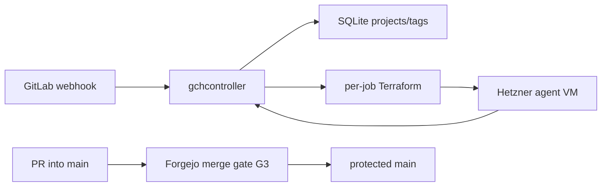
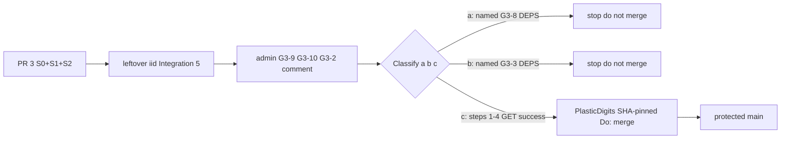
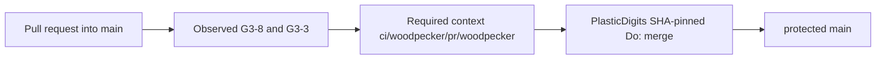

# Architecture overview

`code/gitlab-cursor-webhook` is **GCH** (GitLab Cloud Host): filter GitLab
webhooks and provision ephemeral Hetzner agent VMs that run the Cursor CLI.
Live product map (binaries, routes, filter rules, golden images, Terraform):
[`README.md`](../README.md). Docker/Coolify cutover:
[`docker-deploy.md`](docker-deploy.md). This file is the **merge gate** plus a
short runtime index. Do not copy README narrative here. Do not treat this file
as a second product architecture.

This tree is **not** the archival `PlasticDigits/gitlab-cursor-webhook`
(CAC invariant 21). Do not write that clone from here.

Catch-all `CODEOWNERS` removal is decided in
[ADR 0001](adr/0001-remove-catchall-codeowners.md)
([#3](https://git.cl8y.com/code/gitlab-cursor-webhook/issues/3)); do not
duplicate that narrative. Vehicle **B** copies this file and ADR 0001 onto the
product PR so `main` holds the standing contract. Design branch
`cac-design-issue-3` is transport only. After independent ACCEPT, pin that
accepted hex on leftover `{iid}` and on
[`pulls/3`](https://git.cl8y.com/code/gitlab-cursor-webhook/pulls/3); the
product tip must satisfy
`git diff <accepted> -- docs/adr/0001-remove-catchall-codeowners.md docs/architecture.md`
empty. Do not treat `62ffd58` as copyable.

## Runtime

| Layer | Choice |
|-------|--------|
| App | Rust workspace: `gchcontroller` (HTTP), `gchconfig` (SQLite CLI), `gch-core` (filter/dedup/db). |
| Ingress | `POST /webhook` (Standard Webhooks HMAC). Job API for agent VMs. Admin API behind `GCH_ADMIN_TOKEN`. |
| Data | SQLite (`GCH_DB_PATH`) + per-job Terraform state under `GCH_JOBS_DIR`. |
| Host | Coolify/Docker (`Dockerfile`, [`docker-compose.yml`](../docker-compose.yml)); persist `/var/lib/gch`. Git-follow / auto-rebuild on `main`, `pull_request`, or any non-`main` ref is **not** recorded in-tree. |
| Agents | Isolated Terraform apply of [`terraform/modules/agent-vm/`](../terraform/modules/agent-vm/) from a golden snapshot. |
| Legacy CI file | [`.gitlab-ci.yml`](../.gitlab-ci.yml) is GitLab Secret Detection leftover. It does **not** post Forgejo Woodpecker context `ci/woodpecker/pr/woodpecker`. |



No Coolify rebuild edge: that follow is unverified in-tree (**G3-6**). HMAC
tokens, `HCLOUD_TOKEN`, `CURSOR_API_KEY`, job runtime tokens, and Coolify
UUID/auto-deploy are **not** this ticket
([agent-control #297](https://git.cl8y.com/PlasticDigits/cl8y-agent-control/issues/297)).

## Forgejo merge gate {#forgejo-merge-gate}

Official CODEOWNERS review is **not** a merge gate. Decision, slices, tests,
rollback: [ADR 0001](adr/0001-remove-catchall-codeowners.md). Host write-up:
[cl8y-forgejo#48](https://git.cl8y.com/PlasticDigits/cl8y-forgejo/issues/48)
and forgejo PR **#50** (`docs/INVARIANTS.md` + ADR 0003 item 8). Unauthenticated
HTML of `#48` / forgejo `docs/INVARIANTS.md` **404s**. The six-row table below
is **this repo’s host target** for `main`. Force-push (forge INVARIANTS item
2, “No force-push”) is omitted here and stays #48. Do not treat that table as
INVARIANTS **2–7**. Do not treat fleet / `code/hello` as this repo’s GET. Do
not fork INVARIANTS here. Deploy / spend / custody / policy expansion:
[agent-control #297](https://git.cl8y.com/PlasticDigits/cl8y-agent-control/issues/297)
— this ticket is none of those. Sister CAC autoland predicates are
[#429](https://git.cl8y.com/PlasticDigits/cl8y-agent-control/issues/429), not
this controller. CAC #429 does not merge `#3` or plant-check `{n}`.
[hello#15](https://git.cl8y.com/code/hello/pulls/15) is the fleet canary, not
a local iid.

### Issue #3 body vs host flags

[`issues/3`](https://git.cl8y.com/code/gitlab-cursor-webhook/issues/3) is the
same number as [`pulls/3`](https://git.cl8y.com/code/gitlab-cursor-webhook/pulls/3)
(`pull_request` present). That body is only:

> Remove catch-all CODEOWNERS … Merge gate remains: no direct `main`,
> Woodpecker `ci/woodpecker/pr/woodpecker`, no `force_merge`. See
> cl8y-forgejo#48 and docs/INVARIANTS.md.

Map those three bullets — not a six-row table, not **G3-*** IDs:

| Issue bullet | IDs |
| --- | --- |
| no direct `main` | **G3-2** (`enable_push == false`). `#3` does **not** own force-push (forge INVARIANTS item 2 / named #48). |
| Woodpecker `ci/woodpecker/pr/woodpecker` | **G3-8** ∧ **G3-3** (procedure below). Standing remaining CI gate; not “Woodpecker only under **(c)**.” |
| no `force_merge` | **G3-4** |

**G3-9**, **G3-10**, and **G3-5** are #48 / host flags. Issue `#3` did not
publish them. Keywords in that body are not architecture approval.

### Merge gate (G3)

Three contract groups. The six-row table below is **this repo’s host target**
for `main` (readable with a repo token; unauthenticated HTML of `#48` /
INVARIANTS **404s**). It is **not** forge INVARIANTS **2–7** (item 2 is “No
force-push,” omitted here and assigned to #48). It is **not** text issue `#3`
published. It is **not** a measured GET of this repo pasted into S0.
Unauthenticated
`GET /api/v1/repos/code/gitlab-cursor-webhook/branch_protections` is **401**.
This tree has **no** dated protection JSON in-repo. Do not paste one from an
unauthenticated session. Requiring that GET in S0 would freeze design behind
a token this pass does not have. Fleet values / `code/hello` are not this
repo’s GET. `@PlasticDigits` still comments dated JSON of **this** repo on
leftover `{iid}` and on `pulls/3`. Classify **(a)** / **(b)** / **(c)** from
that dated GET. If it is **(c)**, take the executable sequence below. If it
is **(a)** or **(b)**, **stop** (named DEPS; do not `Do: merge`).

The list endpoint returns an **array**; pick `rule_name == "main"` (or
`GET /api/v1/repos/code/gitlab-cursor-webhook/branch_protections/main`). A
green `cargo test`, a Coolify rebuild, empty commit statuses, or a GET on a
different `code/*` repo is **not** proof of any flag.

Product tip `022f4f5` and design SHA `9f8dec8` had empty commit statuses
(`[]`). There is no `.woodpecker.yaml` on `main`. Those empty statuses are
the **CI gap** only (not protection flags, not a classification of **(a)** /
**(b)** / **(c)**). Empty `[]` does not distinguish “no yaml” from “this repo
is not a Woodpecker project.” Classification waits on `@PlasticDigits`’s
dated GET on leftover `{iid}` and `pulls/3`.

**Observed vs target.** Leftover-complete **records** dated observed JSON and a
written vs-target diff **after (c)** land of `#3` (the only merge path; see
Rollout in ADR 0001). Drift after that is a **#48 leftover**, not a GCH PATCH,
not a reason to restore `CODEOWNERS`, and **not** an S3 fail. Land still
fail-closes on **G3-9** / **G3-10** and on `enable_push != false` (**G3-2**)
via the same dated GET (ADR Tests item 7 / Integration item 6) while leftover
official requests remain (they do on
[#3](https://git.cl8y.com/code/gitlab-cursor-webhook/pulls/3) and
[#2](https://git.cl8y.com/code/gitlab-cursor-webhook/pulls/2)). Leftover-complete
does **not** fail on post-land **G3-2** drift (record-not-fail). S2 implement
does not perform the GET. Repo admin **comments** the GET body; see ADR 0001
actors.

#### Protection GET target (six flags)

**This repo’s host target** for `main`. Not forge INVARIANTS **2–7**. Force-push
stays [cl8y-forgejo#48](https://git.cl8y.com/PlasticDigits/cl8y-forgejo/issues/48).
Not a measured GET of `code/gitlab-cursor-webhook` pasted here. Not the
issue-`#3` body.

| ID | Flag | Target |
| --- | --- | --- |
| **G3-2** | `enable_push` | `false` (no direct push to `main`) |
| **G3-8** | `enable_status_check` | `true` |
| **G3-3** | `status_check_contexts` | `["ci/woodpecker/pr/woodpecker"]` (array **equal**, not subset) |
| **G3-9** | `required_approvals` | `0` |
| **G3-10** | `block_on_official_review_requests` | `false` |
| **G3-5** | `block_on_rejected_reviews` | `true` |

Merge procedure is not a protection field.

**G3-2** target is `enable_push == false` (issue `#3` bullet “no direct
`main`”). `#3` does **not** own force-push: forge INVARIANTS item 2 (“No
force-push”), force-push allowlist fields (if the host exposes them), and
`apply_to_admins` stay
[cl8y-forgejo#48](https://git.cl8y.com/PlasticDigits/cl8y-forgejo/issues/48).
Land of `#3` fail-closes if the dated GET shows `enable_push != false`.
Leftover-complete does **not** require a **G3-2** match for S3 pass
(record-not-fail on post-land drift).

A leftover official CODEOWNERS request on an open PR (including #3 and #2) is
non-blocking **only after** repo admin **comments** dated GET JSON of **this**
repo’s `main` rule showing **G3-9**, **G3-10**, and **G3-2**
(`enable_push == false`) on leftover `{iid}` (`iid != 3`) **and** on
`pulls/3`. Never call `#3` the leftover. If
`block_on_official_review_requests` is still `true` here, or
`required_approvals != 0`, or `enable_push != false`, or that JSON is
missing, merge is 405, still review-gated, or would allow direct `main`;
stop; that mismatch is a **named** local/host DEPS (ADR Decision 7 / Tests
item 7). Do not `force_merge`. Do not infer those flags from fleet #48. S2
does not GET.

##### One Woodpecker land rule (classify a / b / c)

Canonical procedure for Decision 7, Tests item 9, land criterion 7, the
**land-of-`#3`** diagram, and the `issues/3` ≡ `pulls/3` body. Host CI is not
an in-diff deliverable of `#3`. This tree had **no** `.woodpecker.yaml` on
`main` when #3 was filed; incomplete product tip
`022f4f510113c6e8fcfd973a0869753a6fb375be` (`draft: false`) and design SHA
`9f8dec8` had **empty** commit statuses (`[]`) — CI gap only.
`.gitlab-ci.yml` does not post `ci/woodpecker/pr/woodpecker`. Do not add
`.woodpecker.yaml` in the #3 diff. Do not add `.woodpecker/`. Do not fake
statuses. Do not `force_merge`.

**Standing gate** (issue `#3` body, and after land): Woodpecker context
`ci/woodpecker/pr/woodpecker` is the remaining CI gate (**G3-8** ∧ **G3-3**
host target). Decision 7 does **not** rewrite that as “Woodpecker only under
**(c)**.” **(a)** / **(b)** are distinct **stop** reasons if a dated GET of
**this** repo’s `main` rule disagrees with that target. Merge of `#3` is
**only** under **(c)**.

Classify only **(a)** / **(b)** / **(c)**. Do not collapse **(a)** and
**(b)**. Do not merge `#3` on **(a)** or **(b)**.

Repo admin dated GET JSON of **this** repo’s `main` rule (same GET as
**G3-9** / **G3-10** / **G3-2**; S2 does not perform it):

- **(a)** `enable_status_check != true` or the field is absent → **G3-8**
  drift. Record a **named** **G3-8** DEPS (cl8y-forgejo iid or a local issue
  that is **not** leftover `{iid}`; parity with **(b)**). **Stop. Do not
  `Do: merge`.** Do not wait on Woodpecker as a substitute for that stop.
  Distinct from **(b)**. This is not a rewrite of the issue body.
- **(b)** `enable_status_check == true` and `status_check_contexts` is
  **not** equal to `["ci/woodpecker/pr/woodpecker"]` → **G3-3** drift.
  Record a **named** **G3-3** DEPS (same iid rules as **(a)**). **Stop. Do
  not `Do: merge`.** Distinct from **(a)**. Do not merge after recording
  the DEPS iid alone, and do not merge after observed-context success
  either: land of `#3` is **(c)** only.
- **(c)** `enable_status_check == true` **and** `status_check_contexts`
  equals `["ci/woodpecker/pr/woodpecker"]`. The host requires that context
  on the product-tip SHA. Merge of `#3` **only** under **(c)**. Clearing
  **G3-8** / **G3-3** is forge `#48` / founder, **not** a `#3` land option.
  Do not document a ticket that relaxes those rows. Unstick is: get
  `ci/woodpecker/pr/woodpecker` **success** on the product-tip SHA, or
  **stop**.

  **Executable (c) sequence** for this repo (post the context **before**
  merge; do not “block until green, then unstick”). No **may**. Item 7
  **(c)** is steps 1–4 (GET success). Step 5 / **G3-4** is after Integration
  items 5, 6, and 7:

  1. **Operator preconditions, then who posts.** Before expecting statuses
     on `{w}`: **`@PlasticDigits`** activates `code/gitlab-cursor-webhook`
     in Woodpecker, turns **Allow pull requests** on, and has an agent
     online. If `{w}` was opened first, retrigger. These are operator
     preconditions, **not** leftover `{iid}`, **not** a ticket that clears
     **G3-8** / **G3-3**. Per-branch yaml read is true; it does **not**
     activate the repo, install the Forgejo webhook, turn on Allow pull
     requests, or put a runner online. Empty `[]` does not distinguish “no
     yaml” from “this repo is not a Woodpecker project.”

     Human owner who authors the first in-repo pipeline:
     **`@PlasticDigits`**. Opens predecessor PR `{w}` in **this** repo only
     (`iid != 3`, `{w}` is not leftover `{iid}`) whose tip **adds** root
     `.woodpecker.yaml` (**not** `.woodpecker/`). `when` must include
     `pull_request` so the posted name is **exactly**
     `ci/woodpecker/pr/woodpecker` (a `.woodpecker/ci.yaml` posts
     `ci/woodpecker/pr/ci`; `when:` of only `push` posts
     `…/push/woodpecker`). Woodpecker reads the pipeline from `{w}`’s own
     **tree**, so `{w}` does not need yaml on `main` first.

     Pipeline contents: contributor checks only that can succeed on this
     tree (this repo already has `.gitleaks.toml`). No Terraform, Coolify,
     Hetzner, compose, tokens, or auto-deploy in that pipeline. Do **not**
     copy `code/hello`’s `.woodpecker.yaml` (gitleaks + opengrep + trivy +
     coolify-deploy on `push`/`main`): this tree has no `.opengrep.yml`,
     and after `{w}` merges a `main` push can hit Coolify (#297). A noop
     `echo` makes the standing Woodpecker gate a paper check after
     CODEOWNERS is gone.

     **`@PlasticDigits` records `{w}` on `pulls/3` when opening it.** A
     leftover “enable/post” issue with no posting workflow is **not**
     sufficient DEPS.
  2. **Who merges `{w}` (same (c) rule).** `{w}` is under the same required
     context as `#3`. If statuses stay empty/`pending` after yaml exists,
     diagnose activation / webhook / runner / `when` / filename — **not**
     “need more yaml.” Merger: **`@PlasticDigits`** after
     `GET /api/v1/repos/code/gitlab-cursor-webhook/statuses/{w-tip-sha}`
     includes `ci/woodpecker/pr/woodpecker` in a **success** state, then
     SHA-pinned `Do: merge`. S2 never merges `{w}`. CAC #429 does not merge
     `{w}`. Do not `force_merge`. Do not clear **G3-8** / **G3-3** to land
     `{w}`. If nothing posts, `{w}` cannot land under **(c)**; that is
     deadlock, not an unstick.
  3. **`#3` needs a new push.** After `{w}` is on `main`, **`@PlasticDigits`
     comments on `pulls/3` that `{w}` is on `main`** so S2 can resume. The
     **first** S2 session still **stops** after leftover `{iid}` + Decision
     7 comment. S2 then **rebases** `#3` onto that `main` and **pushes**
     (new product-tip SHA). Rebase is load-bearing: Woodpecker reads the
     **tree** of the new SHA, not the diff vs `main`. An empty-commit of
     `022f4f5` (no yaml in tree) will not post. Do not merge `022f4f5`. The
     `#3` diff vs `main` still must **not** add `.woodpecker.yaml`. If
     Woodpecker does not post after that push, **stop**.
  4. `GET /api/v1/repos/code/gitlab-cursor-webhook/statuses/{new-product-tip-sha}`
     shows `ci/woodpecker/pr/woodpecker` in a **success** state.
  5. **`@PlasticDigits`** SHA-pinned `Do: merge` of `#3` after Integration
     items 5, 6, and 7. Item 7 **(c)** **is** steps 1–4 (GET success).
     Step 5 **is** the merge (**G3-4**). S2 never merges `#3`.

File-delete + docs on the tip does not satisfy **(c)**. There is no “when
one exists” hedge.

#### Merge procedure

| ID | Rule |
| --- | --- |
| **G3-4** | SHA-pinned `Do: merge` with `head_commit_id`. Never document or use `force_merge`. **Land of `#3`:** actor `@PlasticDigits` after ADR Integration items 5, 6, and 7 (item 7 **is** Decision 7 **(c)** steps 1–4; step 5 **is** this merge); **S2 never merges `#3`**. **Standing after land:** actor `@PlasticDigits`; no leftover `{iid}` attest. CAC [#429](https://git.cl8y.com/PlasticDigits/cl8y-agent-control/issues/429) does not merge `#3` or plant-check `{n}`. |

#### Tree contracts

| ID | Rule |
| --- | --- |
| **G3-1** | `test -f` fails on `CODEOWNERS`, `docs/CODEOWNERS`, `.gitea/CODEOWNERS`, and `.forgejo/CODEOWNERS`. |
| **G3-6** | This Coolify app **may** rebuild if the existing host is git-follow on `main` (not verified in-tree). [`docker-compose.yml`](../docker-compose.yml) and [`docker-deploy.md`](docker-deploy.md) only record Dockerfile deploy plus `/var/lib/gch`. They do **not** record git-follow, auto-deploy, rebuild-on-`main`, or Coolify builds on `pull_request` / non-`main`. This ticket does not add PR deploys, rotate tokens/UUIDs, or edit `Dockerfile` / `docker-compose.yml` / entrypoint. A rebuild is not leftover-complete and is not a #297 grant. **Happy-path plant-check `{n}`:** ADR 0001 Tests item 4 — trigger planting by opening **ready** or opening draft/WIP then stripping the prefix / marking ready; pass GET is `draft == false` with no WIP prefix **immediately after that ready transition**; empty draft GET is not a pass; present on draft still fails; comment `do-not-merge` then **close without merge in the same session**; do not leave `{n}` open ready; merged `{n}` still fails leftover-complete. Recovery if `{n}` merges: same item. Coolify secrets never attach to `pull_request` events. |
| **G3-7** | This tree does not expand CAC merge/deploy/spend/custody policy. |

Forgejo loads the first existing file among `CODEOWNERS`, `docs/CODEOWNERS`,
`.gitea/CODEOWNERS`, and `.forgejo/CODEOWNERS` (Go-regexp, not GitHub globs;
`.forgejo/` added in forgejo#8773; `.gitea/` remains in the walk). After
ADR 0001, **G3-1** holds. None of those four paths may contain a reviewer rule
for any pattern (ADR 0001 Decision 2). Do not leave an empty or comments-only
file; Forgejo still parses it.

##### Land of #3 (not standing)

Leftover `{iid}` with two `@login`s, admin **G3-9** / **G3-10** / **G3-2**
comment on leftover `{iid}` and `pulls/3`, then Decision 7 classify
**(a)** / **(b)** / **(c)**. Merge **only** under **(c)** (steps 1–4 through
GET success, then **G3-4**). **(a)** / **(b)**: stop, record the named DEPS,
do not `Do: merge`. Merger is **`@PlasticDigits`**. S2 never merges `#3`.
Land uses this diagram only.



Case **(c)** for `#3` is steps 1–4 above (item 7), then step 5. This `#3`
diff must not add `.woodpecker.yaml`.

##### Standing merge after land (not the #3 checklist)

Observed **G3-8** ∧ **G3-3** without leftover `{iid}`. Integration items 5–7
are land-of-`#3` only, not the forever **G3-4** contract. Standing after land
uses this diagram only.



`cargo test` / `cargo clippy` are contributor checks, not **G3-3**.

This tree does not change Forgejo protection JSON, CAC autoland predicates, or
Coolify app config. Those remain
[cl8y-forgejo#48](https://git.cl8y.com/PlasticDigits/cl8y-forgejo/issues/48),
[cl8y-agent-control#429](https://git.cl8y.com/PlasticDigits/cl8y-agent-control/issues/429),
and [agent-control #297](https://git.cl8y.com/PlasticDigits/cl8y-agent-control/issues/297)
respectively.

## Directory (agents)

```
crates/gchcontroller/  HTTP webhook + job API + Terraform provision
crates/gchconfig/      SQLite CLI
crates/gch-core/       filter, dedup, db, prompt render
terraform/             firewall + agent-vm module
docs/adr/              versioned decisions
docs/architecture.md   this file (merge gate G3; not product architecture)
README.md              product map
docs/docker-deploy.md  Coolify cutover
docs/admin-golden-image.md
.gitlab-ci.yml         GitLab leftover; not the Forgejo merge context
```

## ADRs

| ADR | Topic |
|-----|-------|
| [0001](adr/0001-remove-catchall-codeowners.md) | Remove catch-all CODEOWNERS ([#3](https://git.cl8y.com/code/gitlab-cursor-webhook/issues/3)) |
